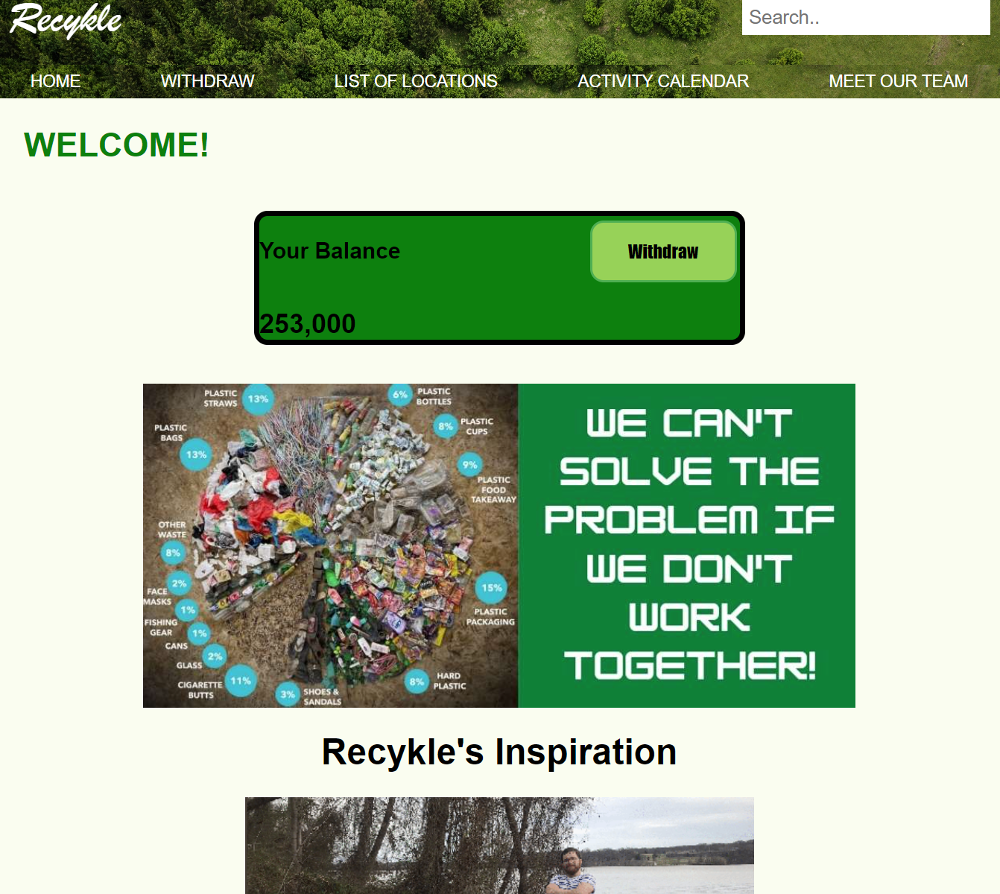
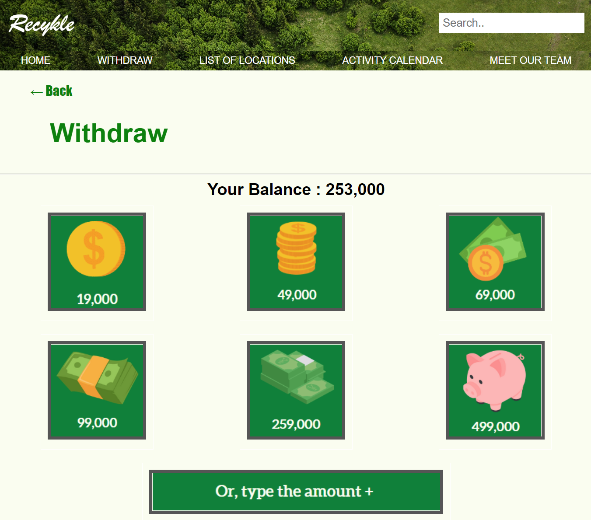
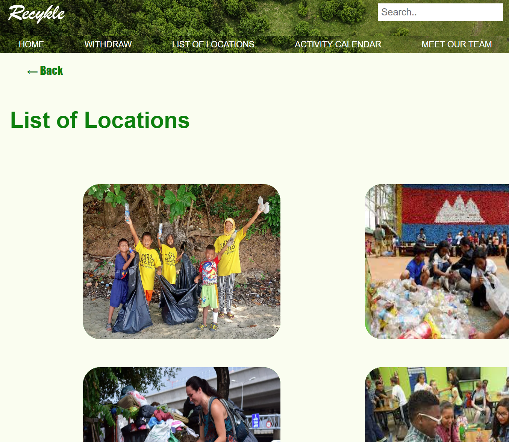
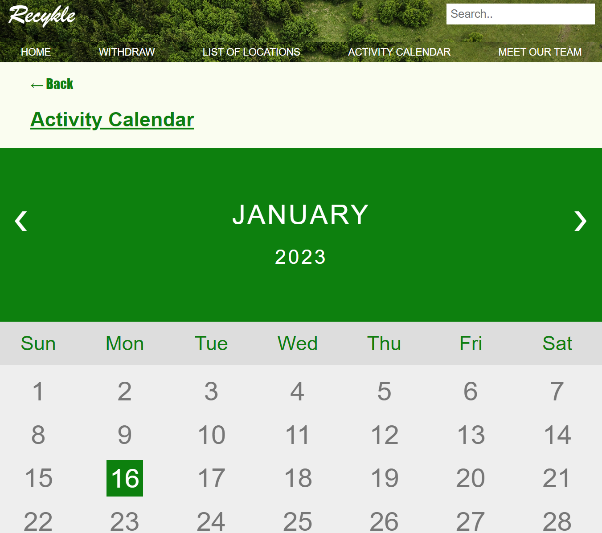
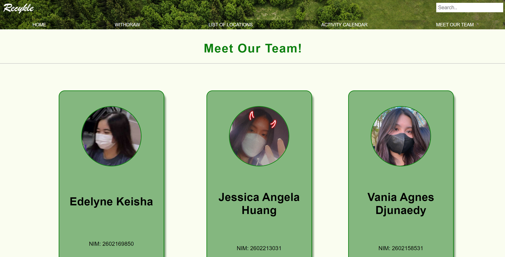

# Human Computer Interaction Final Project: Recykle

## Powerpuff Girls

Edelyne Keisha - L1BC - 2602169850

Jessica Angela Huang - L1BC - 2602213031

Vania Agnes Djunaedy - L1BC - 2602158531

## Overview

Recykle is a website for anyone from anywhere to be able to help out in the environment by cleaning up trash in places that need it. In this day and age, there are a lot of rubbish lying around, ranging from food waste to the most dangerous of all, plastic. So with this website, we hope to be able to achieve a much cleaner environment for everyone to live in. 

To encourage more people to clean up, we also established a point system in which gathering enough points will allow a user to withdraw money in forms of OVO, Gopay, and others.

## Future Additions

1. Users will be able to login and register.
2. Search Bar will be more functional.
3. Better UI Design in the future.
4. More pages will be available.

## Preview

First Page

Second Page

Third Page

Fourth Page

Fifth Page

## Live Link

To see the results, click: https://edeliciouso.github.io/Recykle/
